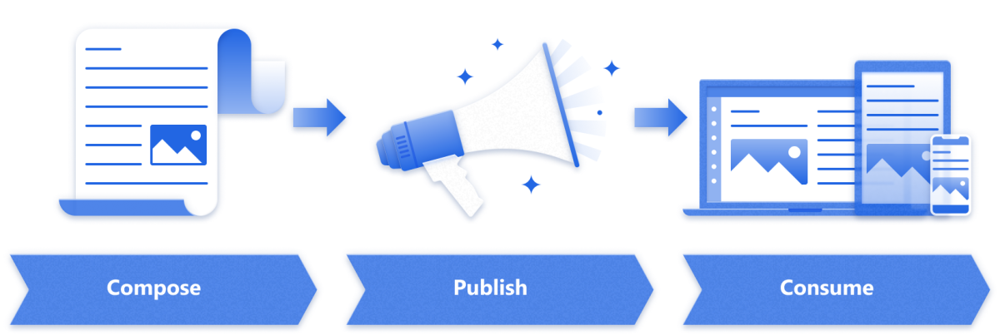
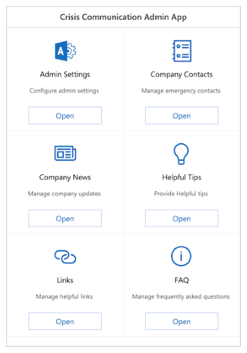
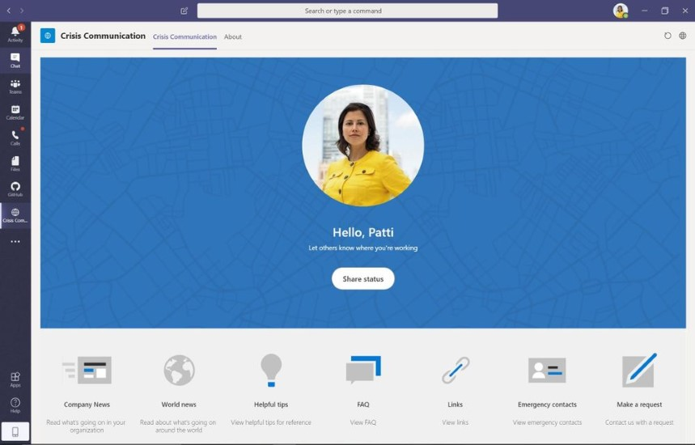
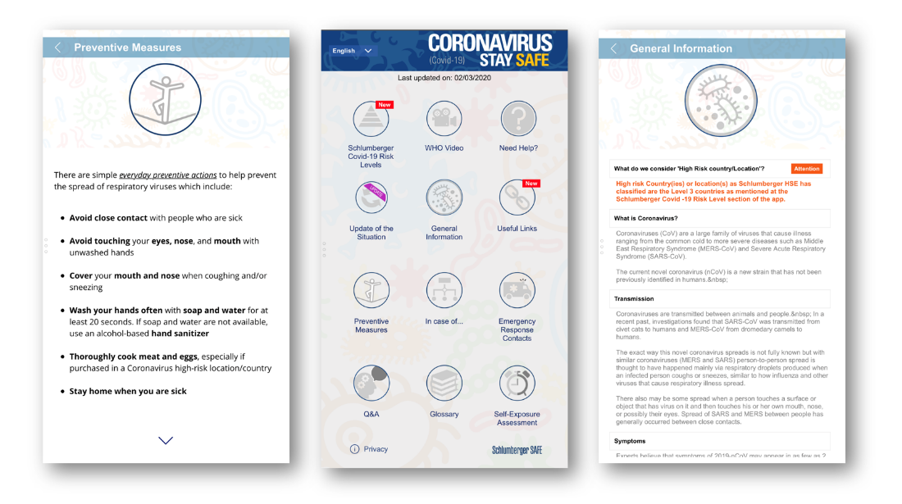
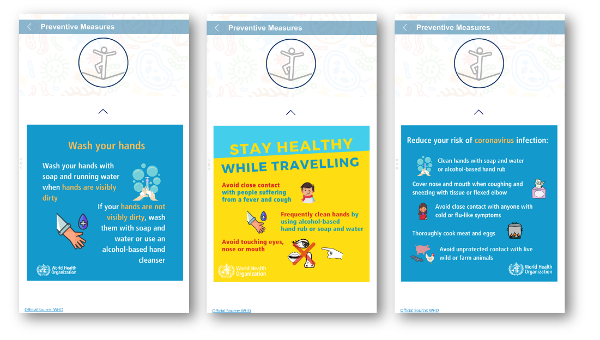
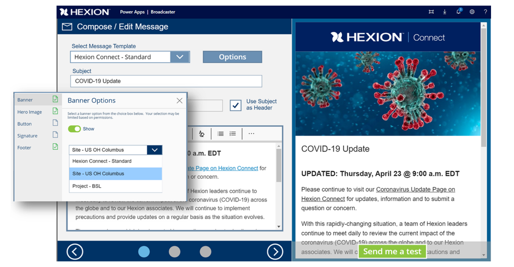

# Pattern: Communication

<!---->

Want to quickly share news, event announcements, and the latest up-to-date information
with your employees no matter where they are? A common use of Microsoft Power Platform is
to provide highly tailored and visually compelling communications via an app.

This article provides several examples of
real-world use cases that showcase organizations using Microsoft Power Platform to
communicate information to employees.

## How to recognize the communication/announcement pattern

In a typical communication scenario:

1. A communication team creates information to be published to the
    organization. For example:

    - An HR department might share news across the organization.

    - A field services team might create field technician bulletins.

1. Information is published to employees.

    - This might be done on a regular basis like daily news or weekly newsletters,
        occasional announcements of events such as training, or urgent
        communication with important news during an emergency.

    - An app can use a push or pull model to get the latest information from
        the cloud.

1. Employees consume the communication.

    - The communications app keeps all relevant information in one place.

    - The communications app can also enable employees to take action, such as
        signing up for a training or event directly from an announcement.

    - The organization can run analytics on how many employees opened and read
        a communication, to learn what works best for their team.

## Template: Microsoft Crisis Communication app

The Crisis Communication app is a template that connects users with information
during a crisis. You can quickly get updates on internal company news, answers
to frequently asked questions, and access to important information like links
and emergency contacts.

The solution combines capabilities of Power Apps, Power Automate, Microsoft Teams, and
SharePoint. It can be used on the web, on mobile devices, or in Teams.

Key features include:

- Employees can get information, report their work status (working from
    home, for example), and make requests. This helps managers coordinate across their teams
    and helps central response teams track status across an organization.

- Admins can use the app to push news, updates, and content specific to their
    organization, and can provide emergency contacts specific to different
    locations.

- The app includes the ability to add RSS feeds of up-to-date information from
    reputable sources such as the WHO, CDC, or a local authority.

The Crisis Communication Admin app enables the admin to compose news and
information, in addition to configuring the features of the employee app.

The employee app, which can be embedded in Teams, enables users to consume news
and information, and reach out for assistance.

More information: [Video demo of the Crisis Communication solution](https://youtu.be/23SypLXiOTw) [Set up and learn about the Crisis Communication sample template](https://docs.microsoft.com/powerapps/maker/canvas-apps/sample-crisis-communication-app)

## How customers are using the communication pattern

### Schlumberger Coronavirus Stay SAFE app

[Read the whole story.](https://powerapps.microsoft.com/blog/schlumberger/)

For Schlumberger, the health and safety of their employees and contractors is
its first priority. Schlumberger's Health, Safety and Environment (HSE) function
came together at the very early stages of the COVID-19 virus outbreak to raise
awareness and educate employees about preventative measures.

Schlumberger developed a Power Apps solution called Coronavirus Stay SAFE to
provide timely updates to their highly mobile workforce. The app enabled rapid
dissemination of important and relevant information from official health
organizations like the WHO and CDC, in addition to company-specific information.
The app is a single source of truth and a reference for preventive measures to
minimize exposure.

### Telstra Technician Plus app

[Read the whole story.](https://customers.microsoft.com/story/765534-telstra-telecommunications-teams)

Telstra, a leading Australian telecommunications company, was using a number of
resources over the years&mdash;such as online spreadsheets, paper documents, emails,
and websites&mdash;to support the needs of field technicians to properly serve their
customers. The company realized they needed a modern, mobile source of knowledge
and communication for field employees.

Using Microsoft Power Platform, the Field Digitization Team at Telstra built the
Technician Plus app for their field technicians, with role-specific applications
that aid in many of the tasks vital to field work and field management. The
solution also includes a news feed, a Telstra product catalogue that enables
upselling opportunities in the field, and instructional video and podcast hubs.
The solution is used by leaders to efficiently send communications out to the
field.

See the solution in this video: 

### Hexion app to manage company-wide communications

[Read the whole story.](https://customers.microsoft.com/story/810656-hexion-manufacturing-power-platform)

At global chemical company Hexion, managers and the communications department
were sending email widely throughout the company. They needed to target
predefined groups of people and require that communications be approved before
distributing them. In this case, Microsoft Power Platform is used to compose and publish
communications that are consumed in email and Teams.

The IT team in Hexion used Power Apps to build a new Broadcaster app that had richer
capabilities than its previous system and a lower support cost. The app is
now used by the communications lead to broadcast company-wide messages in email
and Teams, and they plan to roll it out to all major project team leaders. The
app's key capabilities and benefits include:

- Authoring of emails with dynamic previews of the formatted versions.

- Letting authors focus on content while the tool manages branding and layout.

- Ability to send a test email before sending the final communication.

- Targeting predefined groups of users.

- Picking the author on whose behalf the email is sent, and having their
    signature be automatically populated.

